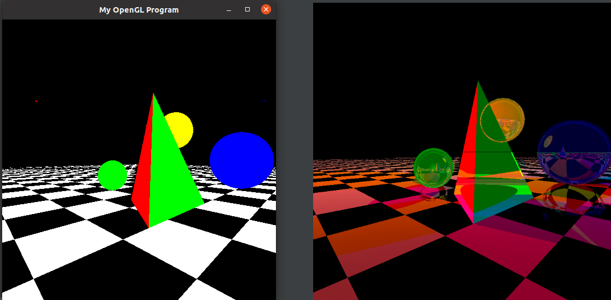

# ray-tracing-opengl
Implementation of Ray Tracing Algorithm
## Output

## OpenGL on Linux
No extra zip/ dll files are required.
Since GLUT (OpenGL Utility Toolkit) depends upon OpenGL and a number of other related libraries, if we install GLUT then OpenGL will be automatically be installed.

Run the following commands to install OpenGL.

`sudo apt-get update`

`sudo apt-get install libglu1-mesa-dev freeglut3-dev mesa-common-dev`

Replace #include <glut.h> with #include <GL/glut.h>

Build & run using the following command :

`g++ main.cpp -o main.out -lglut -lGLU -lGL`

`./main.out`

